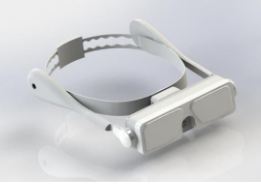

Smart glasses for blind person 

This project works to is for the people who are blind

presentation du model 
Les lunettes offrent une assistance pratique et intuitive, facilitant la vie quotidienne des utilisateurs. Grâce à des fonctionnalités avancées telles que la détection d'obstacles et la navigation assistée, ces lunettes améliorent la confiance et l'autonomie des personnes aveugles dans leurs déplacements. Avec ce modèle novateur, nous cherchons à apporter une véritable amélioration à la qualité de vie des utilisateurs aveugles.
